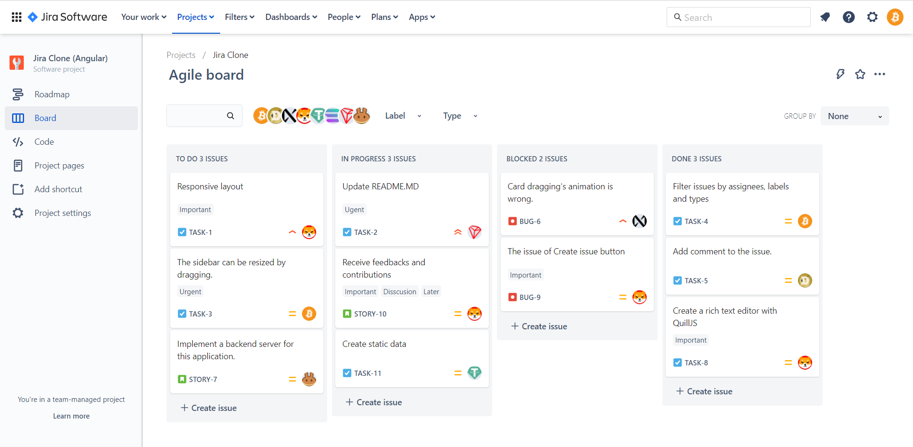

# A Jira Software clone built with Angular, NgRx, TailwindCSS and Ng-Zorro
 
I'm a frontend developer and I want to improve my coding skills and try out new things. It's very difficult to start with a new idea for a practicing project. So I decide to choose a tool and make its clone. I choose a tool that is very familiar to me. That's Jira :)

## Demo

You can see the live demo here: [Live demo](https://ducdv98.github.io/ng-jira-clone/ "https://ducdv98.github.io/ng-jira-clone/")

## Tech stack
- [Angular - The modern web developer's platform.](https://angular.io/)
- [Ngrx - Reactive State for Angular.](https://ngrx.io/)
- [TailwindCSS - Rapidly build modern websites without ever leaving your HTML.](https://tailwindcss.com/)
- [Ng-Zorro - Ant Design of Angular.](https://ng.ant.design/)

## Development Setup
### Prerequisites
- Install  [Node.js](https://nodejs.org/)  which includes  [Node Package Manager](https://www.npmjs.com/get-npm).
- Install [Angular CLI.](https://angular.io/cli)
### Setting Up a Project
- Clone this repository:

      git clone https://github.com/ducdv98/ng-jira-clone

- Install dependencies:
  
      npm install

- Start the development server:

      npm run start

## What's missing?
Currently, this application is running with static data. In the future, I hope I can implement a backend server for it. May be using NestJS.
  
Of course, any contributions or collaborations are welcome.

## Contributing
If you have any ideas, please  [create an issue](https://github.com/ducdv98/ng-jira-clone/issues/new) and tell me what you think.

If you'd like to contribute, please fork the repository and make changes as you'd like.  [Pull requests](https://github.com/ducdv98/ng-jira-clone/pulls)  are warmly welcome.

**Love this repo? Give my repo a star  ⭐  ⬆️.**
